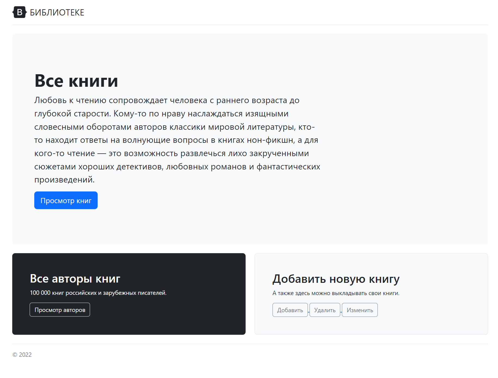
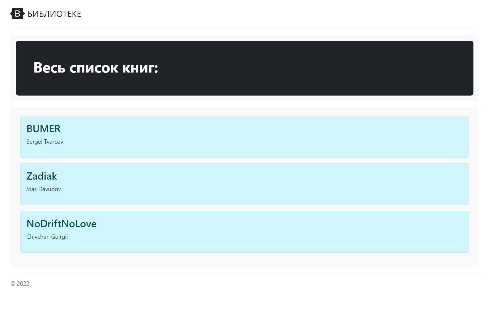
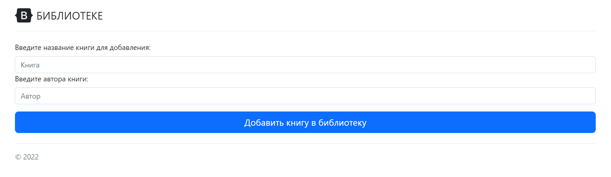
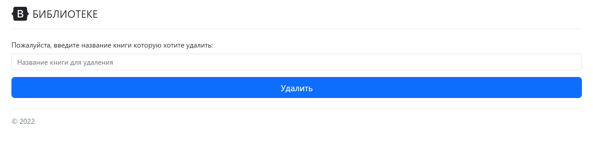
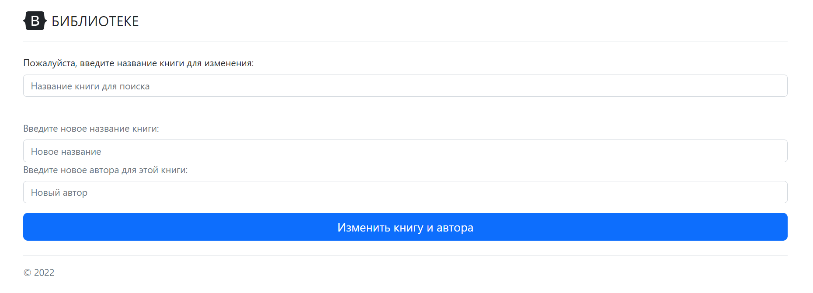

`Любовь к чтению сопровождает человека с раннего возраста до глубокой старости.
Кому-то по нраву наслаждаться изящными словесными оборотами авторов классики мировой литературы,
кто-то находит ответы на волнующие вопросы в книгах нон-фикшн, а для кого-то чтение —
это возможность развлечься лихо закрученными сюжетами хороших детективов,
любовных романов и фантастических произведений.`

`Современные технологии подарили нам прекрасную возможность наслаждаться чтением практически в любой обстановке.
Для этого нужно лишь иметь под рукой планшет, ноутбук, или обычный смартфон,
на которые можно скачать книги бесплатно и читать в любом месте в удобное время.`

`Электронные книги обладают множеством достоинств: под рукой всегда целая библиотека,
можно выбрать книгу под настроение, а аудиоверсии можно слушать даже за рулем,
на пробежке или занимаясь ежедневной рутиной.
Новые произведения появляются гораздо быстрее, чем в бумажном варианте,
к тому же за ними не надо ехать в магазин или ждать доставки.`

## Главная страница:

## Список всех книг на сайте:

## Список всех авторов на сайте:

## Функция добавления своей книги:

## Функция удаления книги:

## Функция изменения книги:

